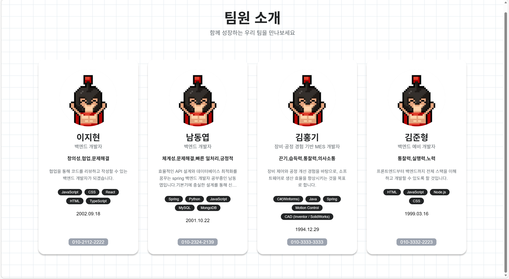

# 팀원 소개 페이지

Git 커밋 협업을 통한 팀원 소개 페이지 프로젝트입니다.



## 프로젝트 구조

```
sparta-git-cowork/
├── index.html          # 팀원 목록 페이지
├── members/           # 팀원 정보 JSON 파일 디렉토리
│   ├── members/
│   │   ├── 남동엽.md  # 남동엽.md 파일 
│   ├── members.json  # 팀원 목록 파일
│   ├── member1.json  # 템플릿 1 (이지현 자기소개서)
│   ├── member2.json  # 템플릿 2 (남동엽 자기소개서)
│   ├── member3.json  # 템플릿 3 (김홍기 자기소개서)
│   ├── member4.json  # 템플릿 4 (김준형 자기소개서)
│   ├── example.json   # 예시 팀원 정보
│   ├── 김준형.md       # 예시 팀원 정보
│   ├── 김홍기.md       # 예시 팀원 정보
│   └── 이지현.md       # 예시 팀원 정보 
└── image/             # 이미지 파일 디렉토리
```

## 시작하기

### 1. 저장소 클론 및 브랜치 생성

```bash
# 저장소 클론
git clone <rhttps://github.com/RyanKor/sparta-git-cowork.git>
cd sparta-git-cowork

# 새 브랜치 생성 (본인의 이름 또는 아이디로)
git checkout -b feature/<본인 이름-기능명>
```

### 2. 본인의 팀원 정보 추가

**방법 1: 기존 템플릿 활용 (추천)**

1. `members/` 디렉토리에서 각자 템플릿을 선택하여 자기소개서를 작성합니다.
   - `member1.json` - 이지현 자기소개서
   - `member2.json` - 남동엽 자기소개서
   - `member3.json` - 김홍기 자기소개서
   - `member4.json` - 김준형 자기소개서
   

2. JSON 파일을 열어 본인의 정보를 작성합니다.
   ```bash
   cp members/member1.json members/본인아이디.json
   ```

<br>
**방법 2: 처음부터 작성**

1. `members/` 디렉토리에 템플릿을 선택합니다.
   - 파일명: `member1.json`(`member1~4까지 선택`)

2. 아래 템플릿을 참고하여 본인의 정보를 작성합니다.

```json
{
  "id": "your-id",
  "name": "홍길동",
  "subName": "풀스택 개발자",
  "profileImage": "image/your-profile.png",
  "introduction": {
    "quote": "자기소개 한 줄",
    "detail": "자기소개 상세 내용"
  },
  "info": {
    "description": "간단한 소개",
    "birthday": "2000.01.01",
    "location": "서울시 강남구",
    "email": "your.email@example.com",
    "phone": "010-1234-5678"
  },
  "strengths": ["의사소통", "도전 정신", "리더십"],
  "skills": [
    { "name": "HTML", "progress": 10 },
    { "name": "CSS", "progress": 10 },
    { "name": "JavaScript", "progress": 15 }
  ],
  "licenses": ["정보처리기사"],
  "education": [
    {
      "name": "스파르타 대학교",
      "period": "2016.03.02 ~ 2020.02.20",
      "gpa": "4.0",
      "location": "서울시 강남구"
    }
  ],
  "experience": [
    {
      "period": "6개월",
      "company": "회사명",
      "term": "2023.01~2023.06",
      "team": "개발팀, 개발자",
      "task": "주요 업무",
      "project": {
        "name": "프로젝트명",
        "term": "2023.02~2023.05",
        "detail": "프로젝트 상세 설명"
      }
    }
  ],
  "projects": [
    {
      "title": "프로젝트명",
      "description": "프로젝트 설명",
      "image": "image/project-image.png",
      "link": "project.html"
    }
  ]
}
```

3. `members/members.json` 파일에 본인의 JSON을 확인합니다.

```json
{
  "members": [
    "member1.json",
    "member2.json",
    "member3.json",
    "member4.json",
    "member5.json",
    "your-id.json"
  ]
}
```

   **중요**: 배열의 순서는 자유롭게 배치할 수 있습니다.


### 3. 변경사항 커밋 및 푸시

```bash
# 변경사항 확인
git status

# 변경사항 스테이징
git add members/members.json
git add sparta_resume_strengths/add index.html  # 이미지가 있는 경우

# 커밋
git commit -m "<이름> 자기소개 및 기능 추가 완료"

# 푸시
git push origin feature/khg-intro
```

### 4. Pull Request 생성

1. GitHub에서 Pull Request를 생성합니다.
2. PR 제목: `<이름> 자기소개 및 기능 추가 완료`
3. PR 설명에 본인의 간단한 소개를 작성합니다.

### 5. 코드 리뷰 및 머지

- 다른 팀원들의 코드 리뷰를 받습니다.
- 승인 후 메인 브랜치에 머지됩니다.

## 주의사항

1. **파일명 규칙**: JSON 파일명은 `member.json` 형식으로 작성하세요.
2. **JSON 형식**: JSON 파일의 문법 오류가 없도록 주의하세요.
3. **이미지 경로**: 이미지 파일은 `image/` 디렉토리에 저장하고, 경로는 `image/파일명.png` 형식으로 작성하세요.
4. **커밋 메시지**: 명확하고 간결한 커밋 메시지를 작성하세요.
5. **충돌 해결**: 다른 팀원과 동시에 수정한 경우 충돌을 해결해야 합니다.

## 예시

### 팀원 정보 추가 예시

```bash
# 1. 브랜치 생성
git checkout -b feature/khg-intro

# 2. 템플릿 복사 (프론트엔드 개발자인 경우)
cp members/member.json members/kim.json

# 3. JSON 파일 수정
# members/member3.json 파일을 열어 본인 정보로 수정

# 4. members.json 업데이트
# members/members.json에 "member3.json" 추가

# 5. index.html 파일 수정
# 기능 추가 - 폰 넘버 UI 표출

# 6. 커밋 및 푸시
git add members/member3.json members/members.json sparta_resume_strengths/add index.html
git commit -m "김홍기 자기소개 및 기능 추가"
git push origin feature/khg-intro
```

### 템플릿별 역할 안내

- **member1.json** (이지현): "strengths" 항목 화면 표출
- **member2.json** (남동엽): "birthday" 항목 화면 표출
- **member3.json** (김홍기): "phone" 항목 화면 표출
- **member4.json** (김준형): 예비군 참석

본인의 역할과 가장 유사한 템플릿을 선택하여 수정하시면 됩니다!

## 문의

프로젝트 관련 문의사항이 있으면 이슈를 생성해주세요.

---
Copyright ⓒ TeamSparta All rights reserved.
